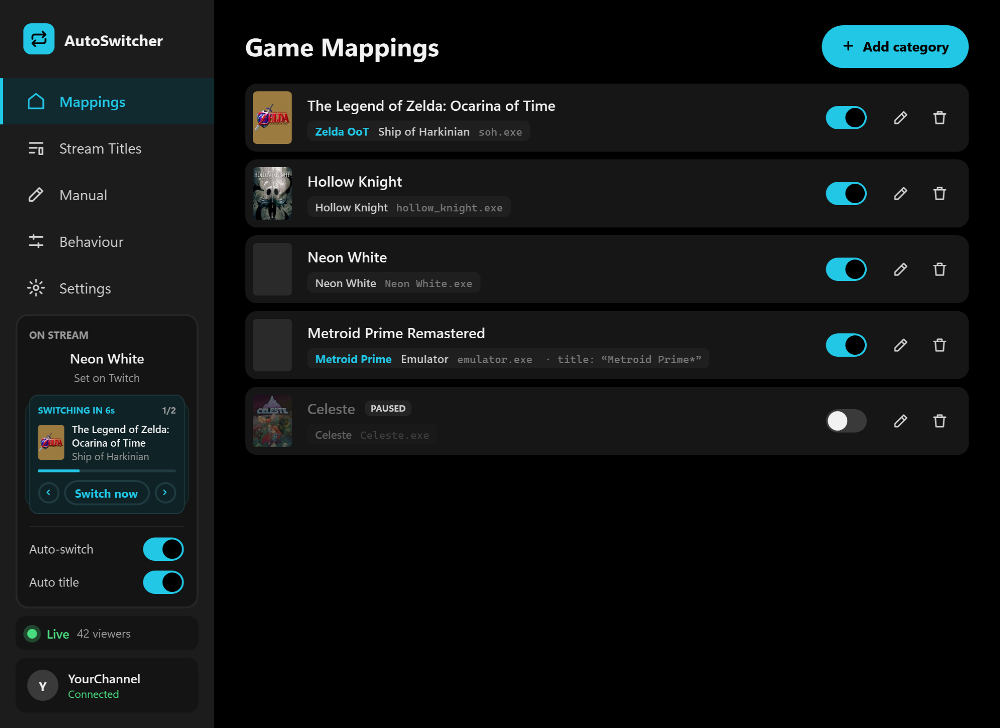
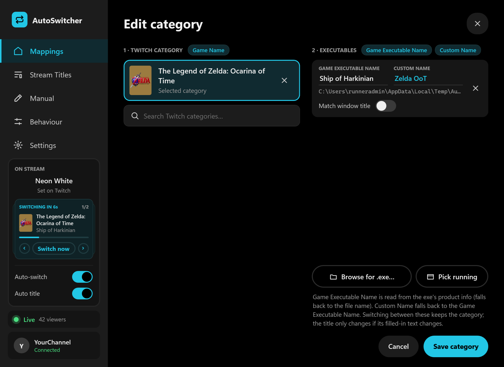
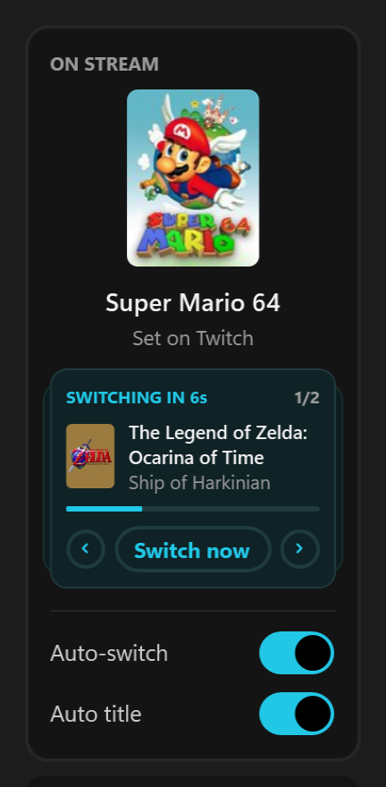
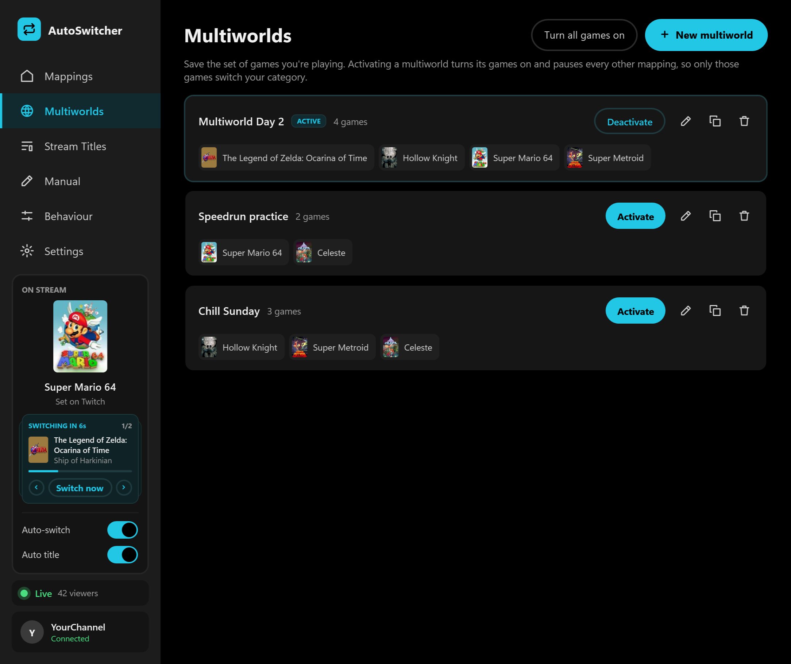
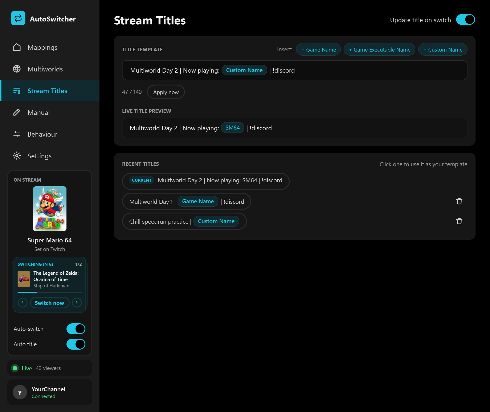
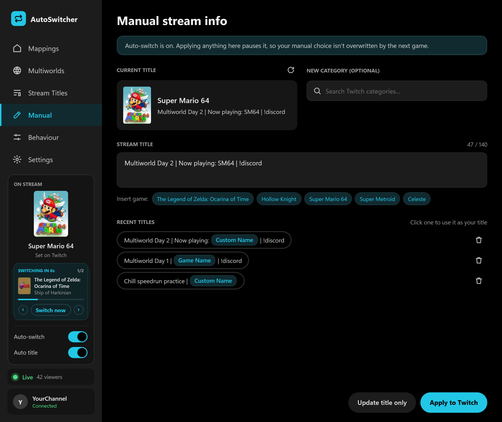
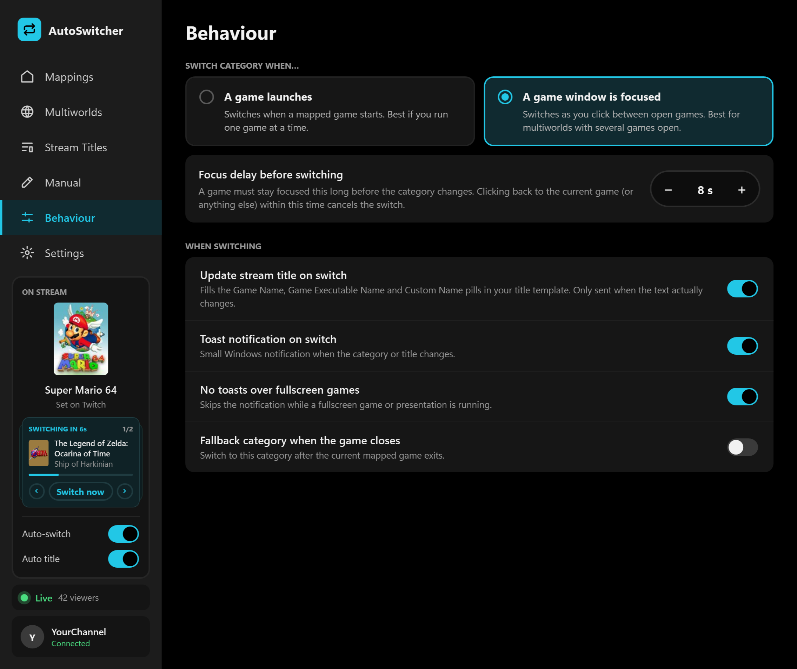
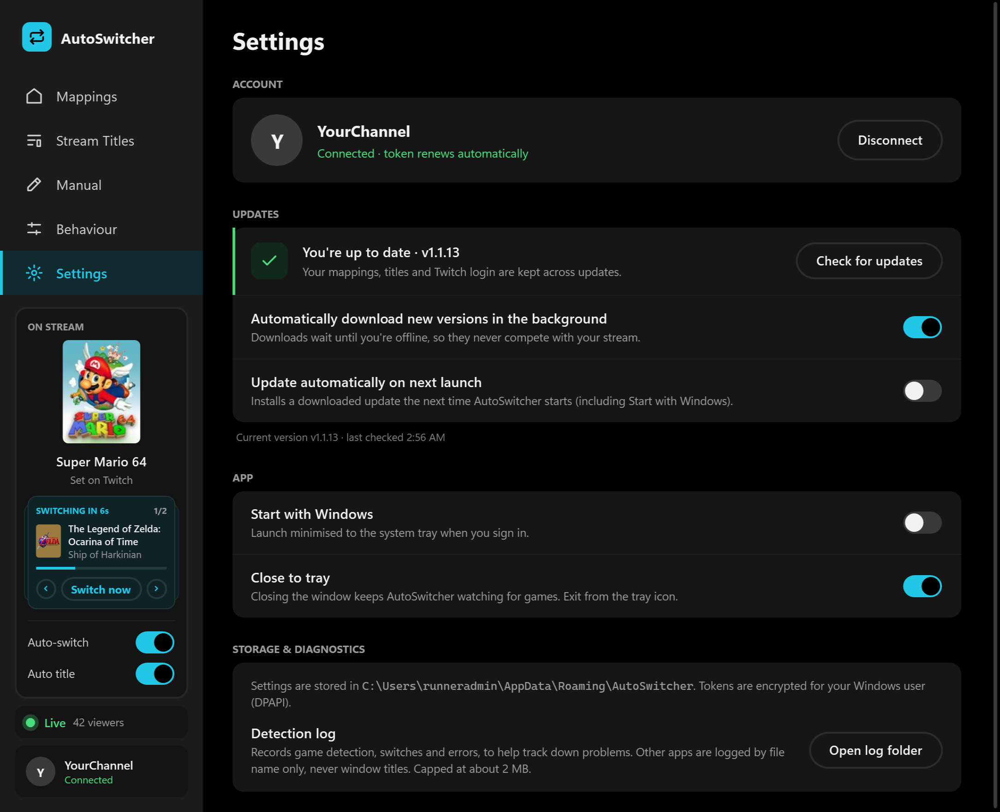

<p align="center">
  
</p>

<h1 align="center">AutoSwitcher</h1>

<p align="center">
  Automatically set your Twitch <b>category</b> and <b>stream title</b> from the game you're playing.<br>
  Built for multiworld and multi-game streams. Fully self-contained: one app, nothing else to install or set up.
</p>

<p align="center">
  
  
  
</p>

<p align="center">
  
</p>

---

## Contents

- [Features](#features)
- [Download & install](#download--install)
- [Getting started](#getting-started)
- [Multiworlds](#multiworlds)
- [Stream titles](#stream-titles)
- [Manual mode](#manual-mode)
- [Emulators & window-title matching](#emulators--window-title-matching) (including [RetroArch](#retroarch))
- [Detection modes](#detection-modes)
- [Notifications](#notifications)
- [Updates](#updates)
- [Privacy & data](#privacy--data)
- [Performance](#performance)
- [Building from source](#building-from-source)
- [Troubleshooting](#troubleshooting)
- [Changelog](CHANGELOG.md)

---

## Features

| | |
|---|---|
| 🎮 **Automatic category switching** | Map Twitch categories to one or more game executables. Launch or focus a game and your category updates. |
| 🌍 **Multiworlds** | Save sets of games and activate one to switch between only those games. |
| 📝 **Stream title templates** | Write your title once with **Game Name**, **Game Executable Name** and **Custom Name** pills. They're filled in on every switch. |
| 🕹️ **Emulator support** | Match by window title as well as by exe, so one emulator can map to many games. Wildcards are supported. |
| 🔍 **Category search with box art** | Search Twitch categories directly. Box art is shown everywhere and cached locally. |
| ✋ **Manual mode** | Set a category and title by hand, which pauses auto-switching until you resume it. |
| 🕘 **Recent titles** | Your current Twitch title and titles you've used before, one click away. |
| 📡 **Live status** | A Live / Offline indicator and a persistent **On Stream** panel showing what's on Twitch, with box art. |
| ⬆️ **Auto-updates** | Checks GitHub for new versions, downloads in the background while you're offline, and installs in one click. |
| 🔔 **Silent toast notifications** | Native Windows notifications with box art when your category or title changes. They never chime on stream. |
| 🔐 **One-click Twitch login** | Secure device-code sign-in that stays connected. There's no client secret and no password stored. |
| 🪶 **Lightweight** | Event-driven detection, tray mode and tiny network usage, so it won't affect game performance. |

---

## Download & install

1. Go to **[Releases](../../releases/latest)** and download **`AutoSwitcher-vX.Y.Z.zip`** (recommended) or the `.exe`.
2. Unzip it anywhere and run **`AutoSwitcher.exe`**. There's no installer.

| File | Size | Notes |
|---|---|---|
| `AutoSwitcher-vX.Y.Z.zip` | ~70 MB | Standalone app, zipped. The easiest to share. |
| `AutoSwitcher-vX.Y.Z.exe` | ~180 MB | Standalone app. Runs on any Windows 10/11 x64 PC. |
| `AutoSwitcher-vX.Y.Z-small-needs-dotnet10.exe` | ~26 MB | Requires the [.NET 10 Desktop Runtime](https://dotnet.microsoft.com/download/dotnet/10.0). |

> **"Windows protected your PC"?** The app isn't code-signed yet, so SmartScreen may warn on first launch.
> Click **More info → Run anyway**. Some chat apps (e.g. Discord) also block unsigned `.exe` files, so share the `.zip` or the release link instead.

---

## Getting started

1. **Connect Twitch:** open **Settings** and click **Connect with Twitch**. Approve the short code at `twitch.tv/activate`. That's it, and you stay signed in.
2. **Add your games:** on **Mappings**, click **Add category**:
   - Search for the Twitch category (box art included).
   - Add one or more executables with **Browse for .exe…** or **Pick running**.
   - Optionally set a **Custom Name** for each executable, e.g. `Zelda OoT SoH`.
   - Use the toggle on each category to **pause** it. It stays in your list but is ignored until you turn it back on.
   - **Sort** the list by date added, name, or turned-on first, and use **All games off** / **All games on** to pause or resume everything at once.
3. **Choose how to detect:** on **Behaviour**, pick **A game launches** or **A game window is focused**.
4. **Set your title (optional):** on **Stream Titles**, write a template and insert name pills.

<p align="center">
  
</p>

### The On Stream panel



The **On Stream** panel in the sidebar always shows the category currently set on Twitch. When a mapped game is detected that isn't on stream, it appears underneath: **Switching in Ns** (with a timer bar) during the focus delay, or **Mapped game detected** while auto-switch is off. If several mapped games are running, use the **‹ ›** arrows to flip between them.

**Switch now** works in two ways:

- On a game that's **counting down**, it skips the timer. Auto-switch stays on.
- On **any other game**, it switches to it and **pauses auto-switch**, so you stay on that category while you jump between windows. Click the amber **AUTO OFF** tag (or the Auto-switch toggle) to resume.

<br clear="right">

---

## Multiworlds

Keep every game you own in **Mappings**, and save the ones you're playing together as a **multiworld**:

- **New multiworld**: give it a name and pick its games (it starts with the games that are turned on right now).
- **Activate** turns that multiworld's games on and pauses every other mapping, so only those games can switch your category. The active one is marked **ACTIVE**, and **Mappings** shows a banner while it's on.
- **Deactivate** turns it off and puts every game back on or off exactly as it was before you activated it.
- Turning a game on or off by hand so the games no longer match deactivates the multiworld automatically (your change is kept).
- Each multiworld shows its games at a glance. Use the icons to **edit** (rename or change games), **duplicate** or **delete** it.
- **All games on** / **All games off** turn every mapping on or pause them all (and deactivate any multiworld).
- The active multiworld is remembered when you close and reopen AutoSwitcher.

<p align="center">
  
</p>

---

## Stream titles

Build a title template once and AutoSwitcher fills it in on every switch:

```
AUS 18+ | Multiworld Day 2 | Now playing: [Custom Name] | !discord
```

| Pill | Example | Source |
|---|---|---|
| **Game Name** | The Legend of Zelda: Ocarina of Time | The Twitch category |
| **Game Executable Name** | Ship of Harkinian | Read from the exe's product info (editable) |
| **Custom Name** | Zelda OoT SoH | Your short name per executable (falls back to the executable name) |

- **Live Title Preview** shows exactly what will be sent, with the real names filled in.
- The **character counter** counts the *filled-in* title. Anything past Twitch's 140-character limit is highlighted in red.
- **Only real changes are sent.** Switching between two executables of the same category doesn't touch your title unless its filled-in text actually changes.
- **Apply now** pushes the title immediately. **Recent Titles** keeps your current and previous titles one click away.

<p align="center">
  
</p>

---

## Manual mode

Need to set something by hand? **Manual** lets you pick any Twitch category and write a title directly, with a pill for each mapped game and your recent titles one click away.

- **Apply to Twitch** sets the category and title. **Update title only** leaves the category alone.
- Applying anything here **pauses auto-switch**, so the next game you focus doesn't overwrite your choice. Turn **Auto-switch** back on in the sidebar when you're ready.

<p align="center">
  
</p>

---

## Emulators & window-title matching

Emulators and launchers often run many games from one executable. Turn on **Match window title** for an executable and enter the part of the window title that identifies the game:

| Window title | Match text | Result |
|---|---|---|
| `Donkey Kong 64 (USA) - app31564` | `Donkey Kong 64 (USA)` | ✅ matches regardless of the changing suffix |
| `Super Mario 64 [60 FPS]` | `Super Mario 64` | ✅ FPS counters in the title don't reset the switch |
| `Zelda - OoT - USA` | `Zelda*USA` | ✅ `*` matches anything in between |

- Matching ignores upper and lower case, and the text can appear anywhere in the title.
- **Use current title** copies the live window title so you only need to trim it.
- Map the same emulator to several categories with different title text. The most specific match wins, and a mapping *without* title matching acts as the fallback.
- Loading a new game inside an already-focused emulator is detected too.
- Closing the game while the emulator stays open counts as the game closing.

### RetroArch

RetroArch's window title doesn't include the game, so AutoSwitcher asks RetroArch directly:

1. In RetroArch, turn on **Settings → Network → Network Commands** (the port is `55355` unless you change it).
2. In AutoSwitcher, add `retroarch.exe` to a category. **RetroArch (match the loaded game)** turns on automatically.
3. Load the game in RetroArch and click **Use loaded game**, or type part of its name (e.g. `Super Mario 64`). **Test connection** shows what RetroArch reports.
4. Add `retroarch.exe` to each game's category the same way, with that game's name.

The same "most specific match wins" rule applies, so `Super Smash Bros.` and `Super Smash Bros. Melee` can both be mapped.

---

## Detection modes

| Mode | Best for | How it works |
|---|---|---|
| **A game window is focused** | Multiworlds with several games open | Switches when you click into a mapped game. A configurable **focus delay** (default 8 s) prevents switching while you click back and forth. |
| **A game launches** | One game at a time | Switches when a mapped game starts. When it closes, it switches to another running mapped game, or to your **fallback category** (optional). |

**Fallback category** (Behaviour, optional): when a game closes and no other mapped game takes over, AutoSwitcher switches to this category, after a short wait (30 s by default) so closing one ROM and loading the next doesn't flip to the fallback in between.

<p align="center">
  
</p>

---

## Notifications

When the category or title changes, a native Windows toast shows:

- the category's **box art**,
- **Stream category updated** / **Stream title updated**,
- how it happened: *focused window*, *launched app*, *fallback*, *set manually*.

Toasts are **silent**, and a new switch replaces the previous toast. You can turn them off on **Behaviour**, or in Windows **Settings → System → Notifications → AutoSwitcher**.

---

## Updates

AutoSwitcher keeps itself up to date from this repository's [Releases](../../releases):

- It checks for a new version shortly after starting and every 6 hours.
- When one is found, a notification appears in the bottom-right of the app, and **Settings** shows an amber **Update** tag.
- **Update now** downloads the matching version (standalone or small), installs it and relaunches. It takes a few seconds.
- Every download is checked against GitHub's SHA-256 checksum. If it doesn't match, it's discarded and nothing changes.
- Your mappings, titles and Twitch login are stored in AppData, so updates never touch them.

Options in **Settings → Updates**:

| Option | What it does |
|---|---|
| **Automatically download new versions in the background** | Downloads updates for you, but only while you're **offline**, so it never competes with your stream. |
| **Update automatically on next launch** | Installs a downloaded update the next time AutoSwitcher starts, including **Start with Windows**. Requires the option above. |

AutoSwitcher never installs an update or restarts itself without one of these: you click **Update now**, or you've turned on install on next launch.

<p align="center">
  
</p>

---

## Privacy & data

- **Twitch permission:** only `channel:manage:broadcast`, which lets the app change your title and category.
- **Sign-in:** OAuth Device Code flow with a public client. No password is entered into the app and no client secret ships with it.
- **Tokens** are encrypted for your Windows user with DPAPI. They refresh automatically, and if the app isn't used for 30 days you sign in again.
- **Stored locally:**
  - `%APPDATA%\AutoSwitcher\config.json`: mappings, titles, settings
  - `%APPDATA%\AutoSwitcher\tokens.dat`: encrypted tokens
  - `%LOCALAPPDATA%\AutoSwitcher\art\`: cached box art
  - `%LOCALAPPDATA%\AutoSwitcher\updates\`: downloaded updates (removed after installing)
  - `%APPDATA%\AutoSwitcher\logs\`: a small detection log (max ~2 MB). Windows that aren't mapped games are logged by exe name only, never by window title. Open it from **Settings → Open log folder**.
- Nothing is sent anywhere except the Twitch API, plus GitHub when checking for and downloading updates.

---

## Performance

AutoSwitcher is designed to sit in the tray during a stream without being noticed:

- **Focus mode is event-driven:** Windows notifies the app of foreground changes, with a cheap once-a-second check of the foreground window so a brief popup can't cancel a switch.
- **Running games** are tracked by diffing the process list every 2 s, inspecting only *new* processes.
- **Title matching** listens only to the focused emulator's window, not to every window on the system.
- Game exits are detected via the process handle, also without polling.
- In the tray, nothing is rendered and memory is trimmed.
- Network use: one small Twitch status call per minute, plus a request only when something actually changes.

---

## Building from source

Requires the [.NET 10 SDK](https://dotnet.microsoft.com/download/dotnet/10.0) on Windows.

```bat
build.cmd          :: small EXE  → dist\AutoSwitcher.exe            (needs .NET 10 Desktop Runtime)
build.cmd full     :: standalone → dist-standalone\AutoSwitcher.exe
```

<details>
<summary>Project layout</summary>

```
src/
├─ Core/            Twitch API + auth, game detection, switching rules, config, toasts, native interop
├─ Controls/        Category picker, title template editor, over-limit highlighter, recent titles
├─ Pages/           Mappings, Edit category, Stream Titles, Manual, Behaviour, Settings
├─ Assets/          App icon
├─ Theme.xaml       Colours, typography and control styles
└─ MainWindow.xaml  Sidebar, On Stream panel, update toast, page host
```
</details>

---

## Troubleshooting

<details>
<summary><b>The category doesn't switch</b></summary>

- Make sure **Auto-switch** is on (sidebar). Manual mode and a manual **Switch now** pause it. Click **AUTO OFF** to resume.
- Check the category isn't **paused** on Mappings (its toggle is off and it shows a PAUSED tag).
- Check that the executable on the mapping matches the game you're running (path or file name).
- In focus mode, the game must stay focused for the **focus delay** (Behaviour).
- For emulators, check the **Match window title** text appears in the window's title (use **Use current title** to copy it).
- If a game runs as administrator, AutoSwitcher may not notice it *closing* (for the fallback category). Running AutoSwitcher as administrator too fixes that.
- Still stuck? **Settings → Open log folder** shows what was detected and why it did or didn't switch.
</details>

<details>
<summary><b>No toast notifications</b></summary>

- Turn on **Toast notification on switch** on Behaviour.
- Check **Settings → System → Notifications → AutoSwitcher** is enabled.
- Windows **Do Not Disturb** (including "when playing a game") hides toasts.
- **No toasts over fullscreen games** (Behaviour) skips toasts while a fullscreen game is running.
</details>

<details>
<summary><b>"Connect with Twitch" fails or I keep getting signed out</b></summary>

- Check your internet connection and try again. Each code is valid for 30 minutes; if it expired, click **Connect with Twitch** for a new one.
- If the app hasn't run for 30+ days, Twitch requires signing in again.
</details>

<details>
<summary><b>The title was cut off</b></summary>

Twitch titles are limited to 140 characters. The red highlight in the editor shows what will be cut once names are filled in.
</details>
